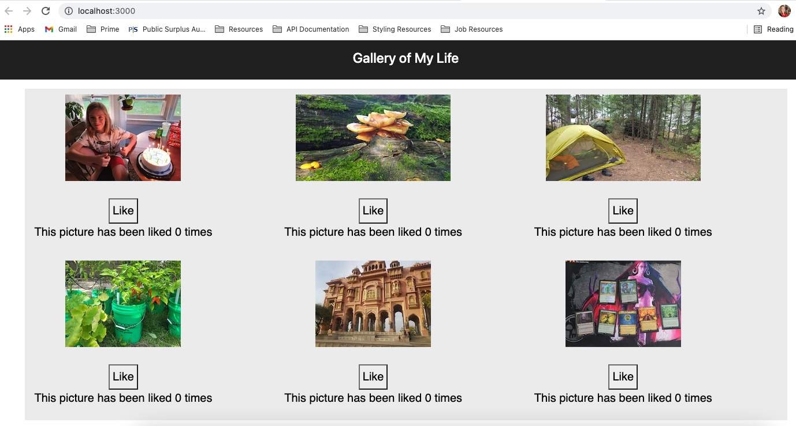
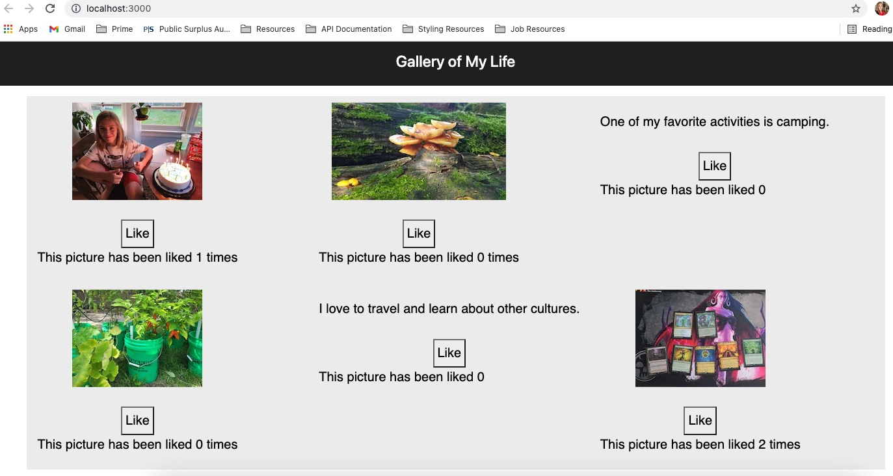

# Project Name

Gallery of My life

## Description

Duration: Two day sprint

Create an app to display a gallery of pictures with descriptions that
tell a story about you and your life.

## Prerequisites
1. Open up your editor of choice and run an npm install
2. Run npm run server in your terminal
3. Run npm run client in your terminal
4. The npm run client command will open up a new browser tab for you!

### Usage
1. Click on the items to learn more about it
2. Click on the description to view the item again
3. Let the user know you like the picture!

### Built With
JavaScript
React
Axios
Bootstrap

### Acknowledgement

Thanks to Prime Digital Academy, instructors Chris and Liz, and my classmates for all the support and encouragement!

